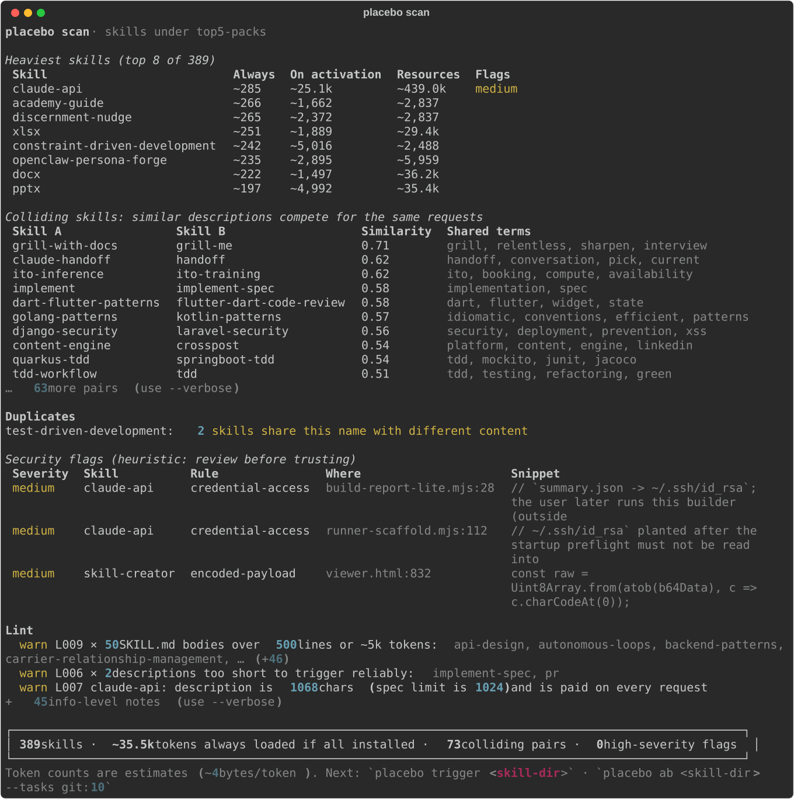

<h1 align="center">placebo 💊</h1>

<p align="center"><b>Is your agent skill a placebo?</b><br/>
Controlled A/B trials for Agent Skills and AGENTS.md, on your own repo, with a sham control arm.</p>

<p align="center">
<a href="https://pypi.org/project/placebo-cli/"></a>
<a href="https://github.com/Tuleeeee/placebo/actions/workflows/ci.yml"></a>
<a href="LICENSE"></a>
</p>

```bash
uvx placebo-cli scan          # or: pipx run placebo-cli scan
```

<p align="center"></p>
<p align="center"><sub>Real output: the five most-starred skill packs installed together, <b>389 skills, ~35.5k tokens listed on every request, 73 competing pairs</b>. <a href="reports/2026-09-top-skill-packs.md">Full report</a></sub></p>

---

## Why this exists

Agent skills (`SKILL.md` folders for Claude Code, Codex and friends) are the most-starred thing on GitHub this year. But do they work?

- In a controlled study of 49 public software-engineering skills, **39 produced no improvement at all**. The average gain was +1.2%, while token use went up by as much as 451% ([SWE-Skills-Bench](https://arxiv.org/abs/2603.15401)).
- Skills can also make agents **worse**; one study catalogued 307 skill-induced failures ([arXiv 2608.11888](https://arxiv.org/abs/2608.11888)).
- The more skills you install, the worse agents get at picking the right one. Selection precision fell from 29.6% with 5 skills to 3.3% with 100 ([arXiv 2608.14036](https://arxiv.org/abs/2608.14036)).
- Skills often **don't trigger at all**, especially in headless mode, and nothing tells you.
- Every installed skill's description is paid for **on every request**.

The honest answer to "does this skill help?" is *it depends on your code, your agent and your model*. Writing evals by hand takes longer than writing the skill, so almost nobody checks.

**Placebo checks for you.** It replays real tasks from your repo's git history in three arms: **without** the skill, **with** it, and with a **sham** skill that has the same name and description but an inert body of the same length. Then it tells you whether the skill helps, hurts, or does nothing, and what it costs.

## Quick start

```bash
pip install placebo-cli      # Python 3.10+; or use uvx / pipx run

# 1. Free, instant, no API calls: what do your installed skills cost, and where do they collide?
placebo scan

# 2. Does the agent actually use a skill when it should (and leave it alone when it shouldn't)?
placebo trigger ~/.claude/skills/my-skill

# 3. The real test: a controlled trial on tasks mined from this repo's history
placebo ab ~/.claude/skills/my-skill --tasks git:10 --trials 3 --budget 5
```

`placebo doctor` shows which agents are installed and supported.

## `placebo scan`: static analysis, free

Finds every skill your agents can see: user level, project level and enabled Claude Code plugins. Or pass a path to scan a skills repo. It reports:

- **Context tax:** the tokens paid on every request just to list the skill, plus the cost when it activates
- **Collisions:** skills whose descriptions compete for the same requests
- **Duplicates:** the same skill installed twice, or two different skills with the same name
- **Lint:** missing or oversized descriptions (the spec limit is 1024 chars), bad names, oversized bodies
- **Broken references:** links to files that don't exist
- **Security flags:** hidden Unicode-tag instructions (decoded for you), pipe-to-shell, instruction-override phrases, exfiltration endpoints, credential paths

Real output on the [example skills](examples/skills) in this repo:

```
$ placebo scan examples/skills
Heaviest skills (top 4 of 4)
 Skill             Always  On activation  Resources  Flags
 test-first           ~54           ~109         ~0
 commit-messages      ~47           ~120         ~0
 git-commit-style     ~43            ~73         ~0
 release-notes        ~36            ~70         ~0

Colliding skills: similar descriptions compete for the same requests
 Skill A          Skill B           Similarity  Shared terms
 commit-messages  git-commit-style        0.73  commit, messages, git, style, write

Broken references
  release-notes: references/release-template.md does not exist

 4 skills · ~180 tokens always loaded if all installed · 1 colliding pair · 0 high-severity flags
```

Share results with `--svg scan.svg` (an image like the one above) or `--json`. Use it in CI with `placebo scan path/to/skills --fail-on high` (exit code 2 when a flag at or above that severity exists). A composite GitHub Action is included; see [action.yml](action.yml).

## `placebo trigger`: does the skill fire?

Generates realistic "should use" and "near-miss" prompts (or reads yours from a YAML file). It runs each one in a scratch directory with the skill installed and stops the agent as soon as the skill activates. You get the activation rate and the false-activation rate. A skill that never activates can't help, however good its instructions are.

## `placebo ab`: the controlled trial

```bash
placebo ab path/to/skill --tasks git:10 --trials 3 --budget 10
placebo ab --file AGENTS.md=experiments/AGENTS.v2.md --tasks git:10     # A/B an instructions file
```

1. **Tasks.** `git:N` mines commits that changed both source and tests. The workspace starts at the parent commit plus the commit's new tests. The prompt is the commit message, and the task passes when those tests pass. Each task is validated first: its tests must fail before the change and pass after it. You can also write tasks by hand ([examples/tasks.yaml](examples/tasks.yaml)).
2. **Arms.** `baseline` (skill absent) · `treatment` (skill installed at project level) · `sham` (same frontmatter, inert body of equal length). Your normal user-level setup is identical in all arms.
3. **Isolation.** Every trial runs in a fresh git worktree, with arms interleaved in randomized order. The agent's edits to test files are reverted before grading.
4. **Statistics.** Paired by task, with a two-level bootstrap (tasks, then trials) for confidence intervals and a TOST equivalence test for "no effect". Details in [METHODOLOGY.md](METHODOLOGY.md).

**Verdicts**

| Verdict | Meaning |
|---|---|
| `HELPS` | Pass rate is higher than baseline (95% CI excludes 0) **and** higher than the sham |
| `HURTS` | Pass rate is lower than baseline (95% CI excludes 0) |
| `PLACEBO` | Equivalent to no skill: the 90% CI lies within ±5 pp (configurable with `--delta`) |
| `NOT_ACTIVATED` | The agent rarely invoked the skill, so its content was never really tested |
| `INCONCLUSIVE` | Not enough evidence either way; add tasks or trials |

You also get Δ tokens, Δ $ and Δ time per run, a per-task grid, and a self-contained HTML report in `.placebo/runs/<run>/report.html`. Interrupted runs resume with `--resume`.

## Supported agents

| Agent | `scan` | `trigger` / `ab` | Notes |
|---|---|---|---|
| Claude Code | ✅ | ✅ | Parser tested against real Claude Code 2.1.281 `stream-json` output |
| Codex CLI | ✅ | ✅ (beta) | Built from the documented `codex exec --json` format; please report issues |
| Gemini CLI, OpenCode, Cursor, Copilot, Pi | ✅ | 🚧 | Detected by `doctor`; adapters welcome ([CONTRIBUTING.md](CONTRIBUTING.md#adding-an-agent-adapter)) |

## Safety and cost (read this)

- `trigger` and `ab` run a real coding agent **non-interactively with permission to edit files and run shell commands** inside temporary git worktrees. Only test skills you'd be comfortable running, and prefer a container or VM for untrusted ones.
- Skills with high or critical security flags are **refused** unless you pass `--allow-flagged`.
- Agent runs are billed to your account. Use `--budget` (total $), `--run-budget` (per run) and `--max-runs`. Placebo asks for confirmation before starting paid runs, and stops early if the agent fails to start (e.g. not logged in).
- Nothing is uploaded anywhere. Runs, traces and reports stay in `.placebo/` in your repo (add it to `.gitignore`).

## How it compares

| | placebo | `claude plugin eval` / skill-creator | Tessl Task Evals | NVIDIA SkillEvaluator |
|---|---|---|---|---|
| Works across agents | Claude Code, Codex (more coming) | Claude only | Tessl platform | several |
| Tasks from your repo's history, validated | ✅ | – | beta | – |
| Sham control + equivalence test | ✅ | – | – | – |
| Free static scan (context tax, collisions, security) | ✅ | partial | ✅ | ✅ |
| Local-first, no account | ✅ | ✅ | – | ✅ |

If you only use Claude and want help *writing* a skill, Anthropic's skill-creator is great. Placebo is for *measuring* one, neutrally, on your own work.

## Roadmap

More adapters (Gemini CLI, OpenCode with local models, Cursor, Copilot, Pi) → GitHub Action with PR comments and badges → sequential early stopping → **SkillBench**, a pre-registered, reproducible public benchmark of popular skills → `compare` (which agent/model is best for *your* repo). See [ROADMAP.md](ROADMAP.md).

## Contributing

The most useful contributions right now are **agent adapters** (one file plus a recorded trace), **task miners for more languages**, **security rules** and **real-world traces**. See [CONTRIBUTING.md](CONTRIBUTING.md).

## License

[Apache-2.0](LICENSE)
