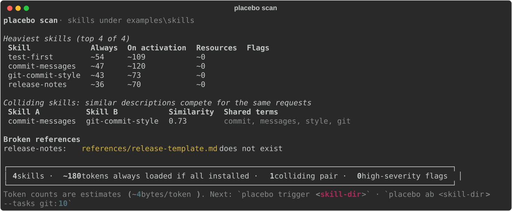

# Example skills

A small set of skills to try Placebo on:

```bash
placebo scan examples/skills
```



They intentionally include problems for the scanner to find:

- `commit-messages` and `git-commit-style` overlap: both claim "write commit messages", so an agent has to guess which to use.
- `release-notes` links to a template file that does not exist.
- `test-first` is a clean skill.

To A/B test one of them on your own repository:

```bash
placebo ab examples/skills/test-first --repo path/to/your/repo --tasks git:10 --trials 3 --budget 5
```
